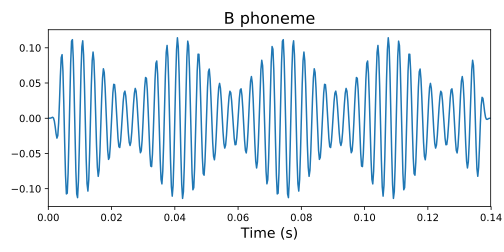
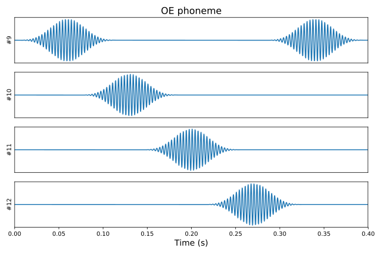
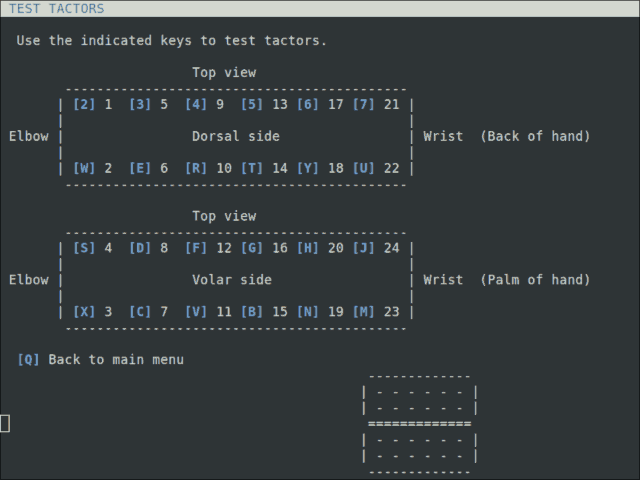
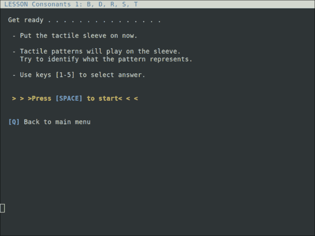
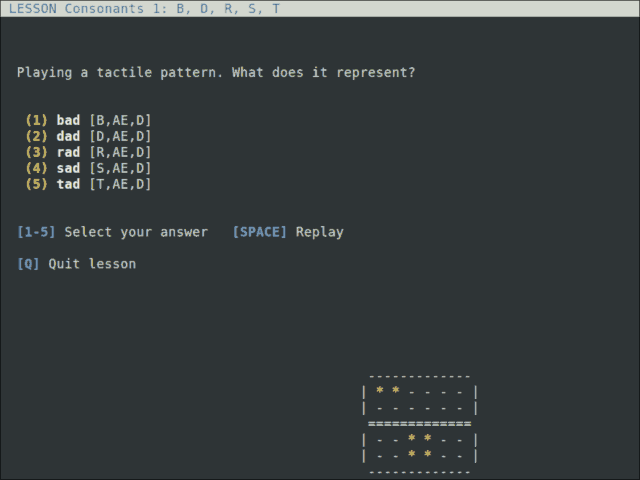
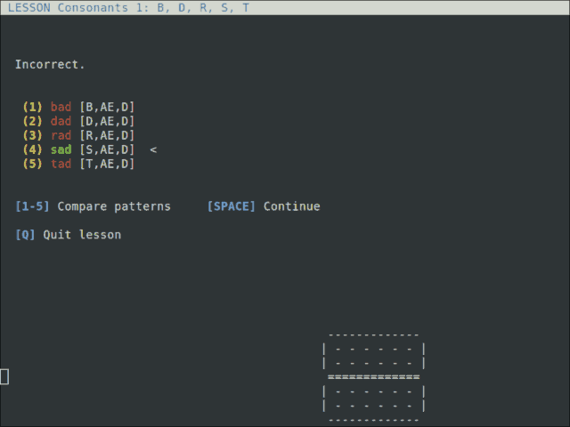
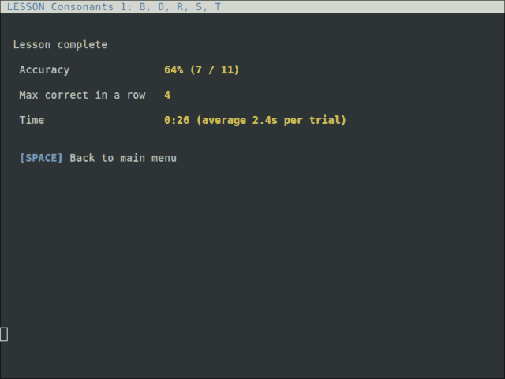
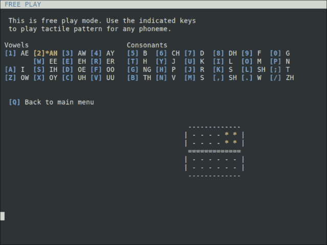

# TActile Phonemic Sleeve (TAPS)


## Overview

We recreated the "TAPS" system, where phonemes are represented with 24-channel
tactile codes, described in

> Charlotte M. Reed, Hong Z. Tan, Zachary D. Perez, E. Courtenay Wilson,
> Frederico M. Severgnini, Jaehong Jung, Juan S. Martinez, Yang Jiao, Ali
> Israr, Frances Lau, Keith Klumb, Robert Turcott, Freddy Abnousi, ["A
> Phonemic-Based Tactile Display for Speech
> Communication,"](https://doi.org/10.1109/TOH.2018.2861010) *IEEE Transactions
> on Haptics*, 2018.

Speech is represented in terms of 39 phonemes. Each phoneme is encoded as a
distinct vibrotactile pattern on the sleeve.

## Hardware

To test this approach, we built a
[24-tactor sleeve](../../../hardware/index.md).


## Phoneme code signals

The phoneme code signals presented on the sleeve are 24-channel waveforms.
For example, the B phoneme code plays on four tactors on the back of the
hand. The signal is a 300 Hz carrier modulated by a raised sine with
frequency 30 Hz. To avoids clicks, a squared Tukey window is applied to taper
the first and last 5 ms of the signal.



As developed in the Reed et al. work linked above, the waveforms are a
sinusoidal carrier with amplitude modulation. The waveforms are sparse, usually
with only 4 out of 24 tactors active at any given time.

Distinct phoneme codes are made by different combinations of

 * carrier frequency (60 or 300 Hz),
 * modulation (e.g. by a raise sine wave of 8 or 30 Hz),
 * subsets of active tactors.

Additionally for vowel phonemes, different sensations of movement are made by
the timing across tactors as another way to make the codes distinct. For
example, here are waveforms for four of the eight active channels in the OE
phoneme, a moving pattern that circles around the middle of the forearm.




## Tactophone training game

[Tactophone](/extras/references/taps/tactophone.h)
is a training game to learn the phonemic tactile codes developed by Reed et
al., the goal being to understand English words from the tactile patterns on
the sleeve.

### First time set up

Some first time set up is needed to find the right output audio device and to
map the order of the 24 channels to your hardware.

#### Identify the output device

Make sure the output device is connected and turned on. Run the Tactophone
program with `--output=-1`:

``` shell
tactophone --output=-1
```

The program will print a list of detected audio devices. Find the desired device
and note the number next to it. If the device is not listed, double-check that
the device is on, unplug and replug the USB connection, and rerun the above
command.

### Channel mapping

Run the program setting `--output` with the name or number of the desired
device, e.g.

``` shell
tactophone --output=6
```

This should show the Tactophone main menu. Press the `[T]` button to enter the
Test Tactors screen.


The Test Tactors screen shows the following ASCII art diagram of the sleeve.



The numbers 1&ndash;24 show how the channel order correspond to locations on
the sleeve. The letter in square brackets is a keyboard button to test that
channel by playing a 200 Hz sinusoid to it. For instance the `[U]` button
tests channel 22, where the intended location is at the right side, wrist end
of the sleeve.

However, chances are that your hardware channels are in some other order, and
need to be reordered to match the visualization. To do this, use the following procedure:

Press the `[2]` button to test channel 1. Notice on the sleeve which tactor is
activated. (If no tactor is activated, or if more than one tactor is active,
there is likely a hardware problem.) Note the location as numbered in the
diagram of the activated tactor. For instance, if channel 1 activates the tactor
at location 20, then write down 20.

Next, pressing the `[W]` button, repeat the above for channel 2. Continue
testing the channels in order (`[X]`, `[S]`, `[3]`, etc.), writing down the
location number corresponding to each channel.

At the end we have a list of 24 numbers. For example
`20,24,23,19,15,11,7,3,13,9,5,1,4,8,12,16,2,6,10,14,18,22,21,17`, which means
channel 1 maps to location 20, channel 2 maps to location 24, etc.

Press `[Q]` repeatedly to quit Tactophone. Rerun it using `--channels` to set
the channel mapping (as a comma-delimited list of numbers, without spaces):

``` shell
tactophone --output=6 --channels=20,24,23,19,15,11,7,3,13,9,5,1,4,8,12,16,2,6,10,14,18,22,21,17
```

Press `[T]` to go to the Test Tactors screen again, and test each button `[2]`,
`[W]`, etc. to verify the channel mapping. If the mapping is correct, then each
button should activate the tactor at the indicated position.

Now Tactophone is ready to use! For future runs, note your settings of `--
output` and `--channels`.

### Training with Tactophone

This section walks through taking a lesson in Tactophone. Each lesson focuses on
learning a few phoneme codes at a time.

1. Start Tactophone with `--output` and `--channels` as described in the
   previous section.

2. The main menu lists the lessons. Press `[1]` to run the first lesson.

   

3. Put on the sleeve and get ready. Press the spacebar button to start the
   first trial.

   

4. A tactile pattern will play on the sleeve. What does it mean? On the first
   try, this is of course an  an unfair question. Select a choice with `[1-5]`
   to proceed.

   

5. After selecting a choice, Tactophone enters a review mode. Here, you can
   press `[1-5]` to play and compare tactile signals for each choice. When
   ready, press spacebar to continue to another trial.

   

6. After enough trials, the lesson ends. A lesson summary with accuracy and
   other stats is shown. Your accuracy is probably not good on first play
   through, but you will improve&mdash;that's what this game is for! Press
   spacebar to go back to the main menu.

   

7. From here, you can retake the first lesson&mdash;try to improve your
   accuracy and speed&mdash;or try other lessons to learn other phonemes.

### Other features and details

#### Free play mode

In the main menu, press `[F]` to enter "free play" mode.



Here you can play the tactile code for any phoneme. This is useful for comparing
phonemes, e.g. for D vs. T, where the difference is subtle.

#### Log of training history

Tactophone records training activity to a log file. The file is `tactophone.log`
by default, or can be set when starting tactophone with `--log=path/name.log`.

Example:

    128 15:51:41] SetLesson lesson=0 (Consonants 1: B, D, R, S, T)
    143 15:51:42] NextTrial lesson=0, question=6, num_choices=5
    143 15:51:42] PlayPhonemes R,EH,D
    192 15:51:45] SelectChoice selected=2, correct=2 (read vs. read)
    202 15:51:45] NextTrial lesson=0, question=0, num_choices=5
    202 15:51:45] PlayPhonemes T,EH,L
    243 15:51:47] SelectChoice selected=0, correct=4 (bail vs. tail)

To facilitate automated parsing and analysis, each log statement begins with the
number of 50 ms clock ticks since startup, followed by a timestamp, an event
identifier (e.g. `NextTrial`), and finally details of the event. Difference of
clock ticks can be used to calculate response times. For instance in the log
above, the response time was 50 ms &sdot; (192 &minus; 143) = 2.45 s on the
first trial and 50 ms &sdot; (243 &minus; 202) = 2.05 s on the second trial.

NOTE: The log can be used to cheat. It should not be viewed while taking a
lesson.


### Lessons file

Tactophone reads the lesson material from the file lessons.txt, or another can
be specified by setting `--lessons=path/lessons.txt` when running tactophone.
You can modify and extend Tactophone by editing this file. For instance, you
could create lessons to exercise particular words, or material for a foreign
language.

The lessons file has a basic text format. An example lesson file, defining two
lessons:

    # Lines starting with '#' are comments.

    # Define a lesson called "Consonants 1: B, D, R, S, T" with 3 questions.
    lesson Consonants 1: B, D, R, S, T
    question bail;B,EH,L dale;D,EH,L rail;R,EH,L sail;S,EH,L tail;T,EH,L
    question bore;B,AW,R door;D,AW,R roar;R,AW,R sore;S,AW,R tore;T,AW,R
    question bun;B,ER,N done;D,ER,N run;R,ER,N sun;S,ER,N ton;T,ER,N

    # Define a lesson with 2 questions.
    lesson Vowels 1: AE, AH, AY, EE, IH
    question bat;B,AE,T bot;B,AH,T bait;B,AY,T beet;B,EE,T bit;B,IH,T
    question cap;K,AE,P cop;K,AH,P cape;K,AY,P keep;K,EE,P kip;K,IH,P

A line `lesson <name>` defines a new lesson and its name. A line starting with
`question` defines a question under the current lesson. The syntax of a question
is a space-delimited list of choices in the form

    question <label1>;<phonemes1> <label2>;<phonemes2> ...

